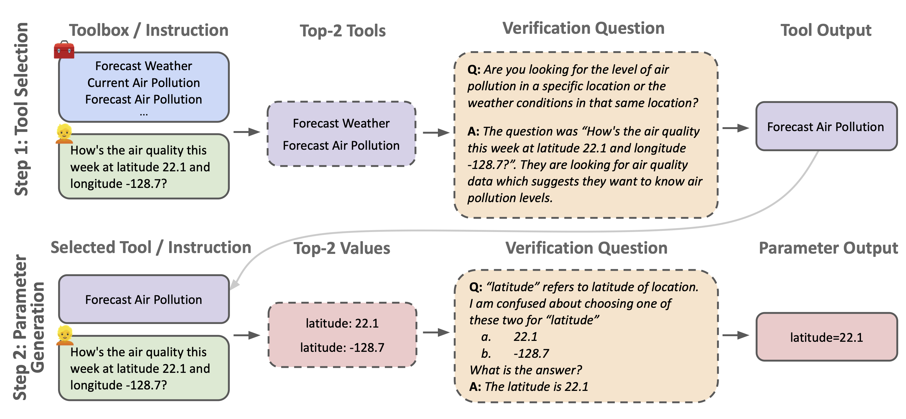

# TOOLVERIFIER: Generalization to New Tools via Self-Verification

This repository contains the ToolSelect dataset which was used to fine-tune Llama-2 70B for tool selection.

## Framework


## Data

**ToolSelect** data is synthetic training data generated for tool selection task using Llama-2 70B and Llama-2-Chat-70B.
It consists of 555 samples corresponding to 173 tools.
Each training sample is composed of a user instruction, a candidate set of tools that includes the
ground truth tool, and a reasoning note elucidating the correct choice of tool.
For example, 
```
User: 10 reviews for "Harry Potter and the Philosopher's Stone".
###
Tool Choices: Bank Account Number generator = The Bank Account Number tool generates a random bank account number for a bank.
Train Ticket Purchase = The Train Ticket Purchase tool gets train tickets for a train, provided stations, and date information.
The Cricket Score tool = The Cricket Score tool gets the score for a match that is happening at a given location and date.
Book Review = The Book Review tool gets the top-rated book reviews for a particular book.
Grocery Shopping with discounts = The Grocery Shopping tool calculates the expense of grocery shopping based on the menu.
Stock Price at location and date = The Stock Price tool gets the stock price for a company at a given location and date.
Movie Recommendation = The Movie Recommendation tool recommends movies based on the user's preferences.
News = The News tool gets the top news for a particular topic or query.
###
Thought: I recommended the Book Review tool because the user asked for reviews of a specific book, "Harry Potter and the Philosopher's Stone". The Book Review tool is designed to provide top-rated book reviews for a particular book, making it the most suitable tool for this request. It will retrieve the top 10 reviews for the book, as requested by the user.
Act: CALLTOOL["Book Review"]
```

### Files
The `data/` folder has 2 files:
* `train.csv` - this file contains the training samples.
* `tools.csv` - this file contains names and descriptions of the generated synthetic tools.

To learn more about the data generation procedure, we direct readers to section 2.1 of our paper.

Paper: https://arxiv.org/abs/2402.14158

## Citation
```
@article{mekala2024toolverifier,
  title={TOOLVERIFIER: Generalization to New Tools via Self-Verification},
  author={Mekala, Dheeraj and Weston, Jason and Lanchantin, Jack and Raileanu, Roberta and Lomeli, Maria and Shang, Jingbo and Dwivedi-Yu, Jane},
  journal={arXiv preprint arXiv:2402.14158},
  year={2024}
}
```
## Licensing
See our LICENSE file for licensing details.
